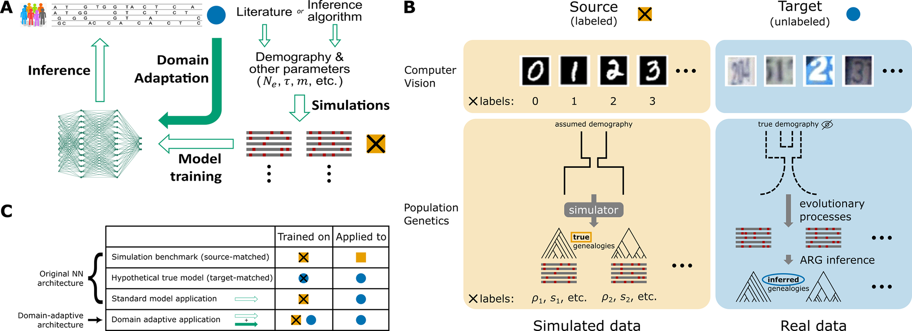

Introduction
============

<<<<<<< HEAD
`Flex-sweep <https://doi.org/10.1093/molbev/msad139>`_ is a versatile tool for detecting selective sweeps. It was primarily designed to be flexible in terms of the types, strengths, and ages of sweeps, being particularly useful for scanning the genomes of non-model species. It only requires a single species, being robust to mis-polarisation, requiring only good genome assemblies and phased haplotypes.

This new version simplifies and streamlines the project structure, files, simulations, and summary statistics estimation. Flex-sweep is now able to easily handle the maximum previous simulations set (20,000 training and 2,000 testing for neutral and sweep scenarios) and predict a 1000KG human population in a few hours, moving from HPC to workstation configuration.

Similar to the first version, Flex-sweep works in three main steps: simulation, summary statistics estimation (feature vectors), and training/classification. Once installed, you can access the Command Line Interface to run any module as needed.

Recommend requirements
----------------------
Flex-sweep is now able to run into a workstation, moving from HPC and high storage necessities. The minimum requirements will depend mainly on the species' genome and the number of samples. We tested Flex-sweep on the entire 1000GP dataset. The examples presented in the documentation run YRI population (n = 108) simulations, summary estimations from simulations, summary statistics from autosomes, training and prediction using the following workstation configuration in a few hours.

The summary statistics estimation heavily relies on numpy arrays, so sample size and RAM consumption are the limiting factors of our software. We tested YRI population workflow using the following recommended configuration to achieve reasonable fast genome-wide predictions.

* Pop!_OS 22.04
* AMD Ryzen 9 PRO 5945 workstation (24 cores)
* 1TB M.2 NVMe SSD
* 64GB RAM
* NVIDIA GeForce RTX 3080

New features
------------
Now simulations take advantages of `demes <https://doi.org/10.1093/genetics/iyac131>`_ to simulate custom demography histories and main `scikit-allel <https://scikit-allel.readthedocs.io/>`_ data structures to avoid external software and temporal files.

The software now works with VCF data, so it is not needed to convert VCF to hap/map files. When using recombination maps, the software will interpolate genetic positions and recombination rates automatically. We included the polarisation script depending only on the ancestral fasta files and VCF.

The software is now able to estimate summary statistics in custom genomic center ranges as well as window sizes. Features vectors are now estimated in custom regions.

We refactor the entire package, focusing on speed and traceability. The code was refactored and takes advantage of `Numba <https://numba.pydata.org/>`_ as much as possible for all the previous statistics except for :math:`nS_{L}` and :math:`iHS`, which rely on scikit-allel functions. All the summary statistic outputs and feature vectors rely on `Polars DataFrames <https://pola.rs/>`_ to avoid the previous huge number of intermediate files and easily inspect outputs while reducing RAM consumption as much as possible.

The new version included optimised versions of `iSAFE <https://doi.org/10.1038/nmeth.4606>`_, `DIND <https://doi.org/10.1371/journal.pgen.1000562>`_, hapDAF-o/s, Sratio, highfreq, lowfreq as well as the custom HAF and H12 as described in `Flex-sweep manuscript <https://doi.org/10.1093/molbev/msad139>`_.

Because we intend to make Flex-sweep as flexible as possible, we included several other summary statistics (note that any other statistic already available in scikit-allel can be used straightforwardly):

* :math:`\Delta\text{-}iHH`: `https://doi.org/10.1126/science.1183863 <https://doi.org/10.1126/science.1183863>`_
* Garud's :math:`H1`, :math:`H12`, :math:`H2/H1`: `https://doi.org/10.1371/journal.pgen.1005004 <https://doi.org/10.1371/journal.pgen.1005004>`_ (numba refactored)
* :math:`\pi`: `https://scikit-allel.readthedocs.io/en/stable/stats/diversity.html#allel.mean_pairwise_difference <https://scikit-allel.readthedocs.io/en/stable/stats/diversity.html#allel.mean_pairwise_difference>`_ (numba refactored)
* :math:`\theta_{W}`: `https://scikit-allel.readthedocs.io/en/stable/stats/diversity.html#allel.watterson_theta <https://scikit-allel.readthedocs.io/en/stable/stats/diversity.html#allel.watterson_theta>`_ (numba refactored)
* Kelly's :math:`Z_{nS}`: `https://doi.org/10.1093/genetics/146.3.1197 <https://doi.org/10.1093/genetics/146.3.1197>`_
* :math:`\omega_{max}`: `https://doi.org/10.1534/genetics.103.025387 <https://doi.org/10.1534/genetics.103.025387>`_
* Fay & Wu's :math:`H` (and :math:`\theta_{H}`): `https://doi.org/10.1534/genetics.106.061432 <https://doi.org/10.1534/genetics.106.061432>`_
* Zeng's :math:`E`: `https://doi.org/10.1534/genetics.106.061432 <https://doi.org/10.1534/genetics.106.061432>`_
* Achaz's :math:`Y`: `https://doi.org/10.1534/genetics.106.061432 <https://doi.org/10.1534/genetics.106.061432>`_
* Fu & Li's :math:`D` and :math:`F`: `https://doi.org/10.1093/genetics/133.3.693 <https://doi.org/10.1093/genetics/133.3.693>`_
* LASSI :math:`T` and :math:`m`: `https://doi.org/10.1093/molbev/msaa115 <https://doi.org/10.1093/molbev/msaa115>`_
* RAiSD :math:`\mu`: `https://doi.org/10.1038/s42003-018-0085-8 <https://doi.org/10.1038/s42003-018-0085-8>`_

Although our current configuration is designed to detect positive selection, we included two other statistics designed to detect balancing selection, which can be used along with other statistics to detect recent balancing selection through CNN (see `BaSE <https://doi.org/10.1111/1755-0998.13379>`_ for further balancing selection analysis using Neural Networks).

* :math:`\beta^{(1)*}_{(std)}`: `https://doi.org/10.1093/gbe/evaa013 <https://doi.org/10.1093/gbe/evaa013>`_
* :math:`NCD1`: `https://doi.org/10.1093/gbe/evy054 <https://doi.org/10.1093/gbe/evy054>`_

The new API allows easy addition of custom CNN architectures, so the user can input custom CNN while training/predicting. Now the CNN class is able to preprocess feature vectors to work not only with the default 2D CNN but also 1D CNN.

To extend for custom configuration, we also included the best rearrangement algorithms from `Zhao, H. and Alachiotis, N. 2025 <https://doi.org/10.1016/j.ymeth.2024.11.003>`_ to work with raw haplotype matrices too. The software included:

* Correlation coefficient sorting
* Derived Allele Frequency sorting
* Occurrence Frequency sorting
* Sub-regions bipartite correlation

We included a rank algorithm to post-process sweep probabilities and ranking for any type of associated genomic element. The function relies on `Pybedtools <https://daler.github.io/pybedtools/>`_ to quickly estimate genomic distances between the genomic region used by Flex-sweep and the genomic element listed in a BED file.

.. A saliency map class to explore which genomic region and statistic are more revelant during training.

Flex-sweep is now able to work with demography and/or BGS mis-specification! We extend our CNN with the Domain-Adaptive (DA) model proposed by `Mo, Z. and Siepel A. 2023 <https://doi.org/10.1371/journal.pgen.1011032>`_. Supervised machine learning in population genetics relies on the assumption that the simulated data would follow same distribution as the empirical data. The DA model implemented is explicitely designed to account for and alleviate such a mismatch between simulated and real data. Flex-sweep is now more versatile to analyze non-model organisms where the quality or availability of simulated parameters such as the mutation rate, recombination rate, and demography are limited.

=======
`Flex-sweep <https://doi.org/10.1093/molbev/msad139>`_ is a convolutional neural
network–based method able to detect a wide range of selective sweep signals,
including those thousands of generations old, from single-species genomic data,
while being robust to background selection. It was primarily designed to be
flexible in terms of the types, strengths, and ages of sweeps, requiring only a
single phased population — without outgroups or admixture data — making it
particularly useful for non-model species.

Flex-sweep 2.0 is a more general-purpose update that streamlines the workflow,
vastly speeds up summary-statistic computation, relaxes CNN constraints by
supporting custom architectures, and enables ancestral-state polarization, while
being highly customizable and robust to model mis-specification. Flex-sweep now
scales to thousands of simulated training scenarios and enables genome-wide
inference on a standard workstation rather than an HPC.

Similarly to the first version, Flex-sweep works in three main steps:
simulation, summary statistics estimation (feature vectors), and
training/classification. Once installed, you can access the Command Line
Interface (CLI) to run any module as needed.

Pipeline overview
-----------------

Simulations
~~~~~~~~~~~

The simulations module takes advantage of `demes <https://doi.org/10.1093/genetics/iyac131>`_
to simulate custom demography histories. The software includes a pre-compiled
`discoal <https://github.com/kr-colab/discoal>`_ binary to avoid external
dependencies (a custom binary path can be provided if needed). Prior parameters
are flexible across different distribution configurations and can be set via
the Python API or CLI without manually editing custom input files.

Feature vector estimation
~~~~~~~~~~~~~~~~~~~~~~~~~

The feature vector module was fully refactored for speed and traceability.
Summary statistics are estimated using Numba and NumPy vectorisation for all
statistics except :math:`nS_L` and :math:`iHS`, which rely on
`scikit-allel <https://scikit-allel.readthedocs.io/>`_ functions. All outputs
rely on `Polars <https://pola.rs/>`_ DataFrames, removing the large number of
intermediate files required by the previous version and substantially reducing
RAM consumption.

The software directly reads VCF files — no conversion to hap/map format is
needed. When using recombination maps, genetic positions and recombination rates
are interpolated automatically.

The refactored version includes optimised implementations of iSAFE, DIND,
hapDAF-o/s, Sratio, highfreq, lowfreq, as well as the custom HAF and H12
statistics from the original Flex-sweep paper. Additional statistics have been
added (see :doc:`advanced_usage` for the full list).

Users can select any custom combination of the available statistics via the
``stats=`` argument, choosing only those most informative for the organism and
sweep type under study. The software also supports user-defined genomic
intervals and window sizes, enabling feature extraction across highly
customisable regions. This design makes it straightforward to reproduce the
feature set of other tools (e.g. diploS/HIC) or to define a tailored feature
vector without writing custom code.

Normalization
~~~~~~~~~~~~~

When a high-quality recombination map is available,
Flex-sweep normalises both SNP-based and windowed statistic within bins defined by 
the empirical recombination distribution. For windowed statistic each input is standardized 
within bins defined by the joint combination of window position, window center,
and local recombination rate, extending the normalization scheme to explicitly
account for recombination rate heterogeneity across the genome:

.. math::
   Z\text{-score} = \frac{\pi_i^{(w,c,r)} - \mu^{(w,c,r)}}{\sigma^{(w,c,r)}}

where :math:`\pi_i` is any given statistic and :math:`\mu^{(w,c,r)}`,
:math:`\sigma^{(w,c,r)}` are the mean and standard deviation computed across
all windows sharing the same window size :math:`w`, center :math:`c`, and
recombination rate bin :math:`r`.

For SNP-based statistics, normalization is performed analogously but conditional 
on derived allele frequency (DAF) and local recombination rate. Specifically,
each SNP-level statistic is first standardized within bins defined
by the joint distribution of DAF and recombination rate:

.. math::

   \pi_{i(std)} = \pi_i^{(f,r)}=\frac{\pi_i^{(f,r)} - \mu^{(f,r)}}{\sigma^{(f,r)}}

where :math:`\pi_i` is the given statistics, :math:`f` denotes the derived allele frequency bin of SNP :math:`i`,
and :math:`\mu^{(f,r)}` and :math:`\sigma^{(f,r)}` are the mean and standard 
deviation computed across all SNPs falling within the same DAF bin :math:`f` and
recombination rate bin :math:`r`. Finally, once each window and center combination is defined
we normalized using the same approach described above.

Training and prediction
~~~~~~~~~~~~~~~~~~~~~~~

Because feature vectors are flexible to any combination of statistics, genomic
center, and window size, the new API provides an automatic interface for custom
CNN architectures — supporting both 1D and 2D CNNs. State-of-the-art haplotype
rearrangement strategies are also available for working with raw haplotype
matrices (see :doc:`advanced_usage`).

Domain-Adaptive Neural Network (DANN)
~~~~~~~~~~~~~~~~~~~~~~~~~~~~~~~~~~~~~~

Flex-sweep is now more versatile for analysing non-model organisms where the
quality or availability of simulated parameters — such as mutation rate,
recombination rate, and demography — is limited. It extends the method to work
with the Domain-Adaptive model proposed by
`Mo, Z. and Siepel, A. 2023 <https://doi.org/10.1371/journal.pgen.1011032>`_.
The Domain-Adaptive Neural Network trains not only on labelled simulated data
but also incorporates unlabelled empirical data during training, learning a
shared representation that is highly predictive for the classification task but
uninformative about the domain (simulated vs. real). In the case of CNN
approaches, models trained under unrealistic demography, recombination, or
mutation landscapes can easily confound sweep prediction due to overfitting of
artifacts; the DANN is explicitly designed to account for and mitigate this
mismatch.

.. note::

   When working with extremely out-of-range demographics (e.g. training over
   constant population sizes) or simulated parameters, domain-adaptive
   training may still perform worse than the plain CNN.

.. To improve robustness under domain shift, Flex-sweep further stabilizes
.. adversarial domain adaptation through controlled gradient scheduling and
.. constrained adversarial strength. Rather than applying a fixed gradient
.. reversal factor throughout training, the model introduces a time-epoch–dependent
.. schedule in which the adversarial signal is gradually increased from zero to a
.. predefined maximum. This allows the model to first learn task-discriminative
.. features from labelled simulated data before progressively enforcing domain
.. invariance using unlabelled empirical data. In addition, constraining the
.. maximum adversarial strength prevents the domain objective from dominating the
.. optimisation process, preserving features that remain informative for
.. classification despite being partially domain-specific. Together, this strategy
.. improves optimisation stability, reduces negative transfer, and promotes
.. representations that generalise more effectively across mismatched empirical
.. and simulated genomic distributions.
>>>>>>> ed421eb (pushing to 2.0. dann, recombination stratification normalization, custom stats, center/windows, outlier scan, partial cms, plotting)

   Figure extracted from `Mo, Z. and Siepel, A. 2023 <https://doi.org/10.1371/journal.pgen.1011032>`_.
<<<<<<< HEAD
   Summary of neural networks, domain adaptation architecture, input data and benchmarking in the context of population genetic inference. Flex-sweep takes the same approach but *Source* and *Target* outputs are now feature-vector images instead of genealogies.
=======
   Summary of neural networks, domain adaptation architecture, input data and
   benchmarking in the context of population genetic inference. Flex-sweep takes
   the same approach but *Source* and *Target* outputs are feature-vector images
   instead of genealogies.

Polarization
~~~~~~~~~~~~

Flex-sweep refactors and extends `est-sfs <https://doi.org/10.1534/genetics.118.301120>`_
to support straightforward allele polarization. Given a focal-species
polymorphism dataset (VCF) and a Multi-Alignment Format (MAF) file, the
pipeline:

1. Subsets up to three outgroup species from the alignment.
2. Extracts aligned outgroup bases at polymorphic sites.
3. Computes per-site posterior ancestral-state probabilities following
   `Keightley and Jackson 2018 <https://doi.org/10.1534/genetics.118.301120>`_.

These posteriors are used to probabilistically assign ancestral and derived
states, enabling downstream selection scans that are robust to ancestral
mis-specification. 
.. This design is intended to take advantage of large
.. comparative genomic resources such as the
.. `Zoonomia Project <https://doi.org/10.1038/s41586-020-2876-6>`_.

Genome-wide outlier scan
~~~~~~~~~~~~~~~~~~~~~~~~

In addition to the CNN/DANN prediction pipeline, Flex-sweep includes a
standalone genome-wide outlier scan that works directly from VCF files without
any simulation or training. Each statistic is computed at its native genomic
resolution and ranked against its empirical distribution to produce a p-value:

.. math::

   p_i = \frac{\text{rank}(-x_i)}{N_{\text{valid}}}

where a small :math:`p_i` indicates a high-scoring outlier window. Statistics
can be normalised jointly by allele frequency and recombination rate when a
recombination map is provided. This provides a fast, assumption-light complement
to the CNN approach, or a standalone analysis when simulations are not
available. See :doc:`scan` for full documentation.

Rank and enrichment
~~~~~~~~~~~~~~~~~~~

A rank algorithm post-processes sweep probabilities and associates them with
any genomic element in a BED file, using
`polars-bio <https://github.com/biodatageeks/polars-bio>`_ to estimate genomic
distances efficiently. See :doc:`prediction` for usage.

To assess whether top-ranked genes or elements are sweep enriched, Flex-sweep implements
the enrichment pipeline described in `Enard et al. 2020 <https://doi.org/10.1098/rstb.2019.0575>`_ 
(see :doc:`enrichment` for details).

Recommended requirements
------------------------

Flex-sweep runs now on a standard workstation. The minimum requirements depend
mainly on the species genome size and sample size. The examples in this
documentation use the YRI population (n = 108) from the 1000 Genomes Project
and were run on the following configuration:

* Pop!_OS 22.04
* AMD Ryzen 9 PRO 5945 workstation (24 cores)
* 1 TB M.2 NVMe SSD
* 64 GB RAM
* NVIDIA GeForce RTX 3080
>>>>>>> ed421eb (pushing to 2.0. dann, recombination stratification normalization, custom stats, center/windows, outlier scan, partial cms, plotting)
